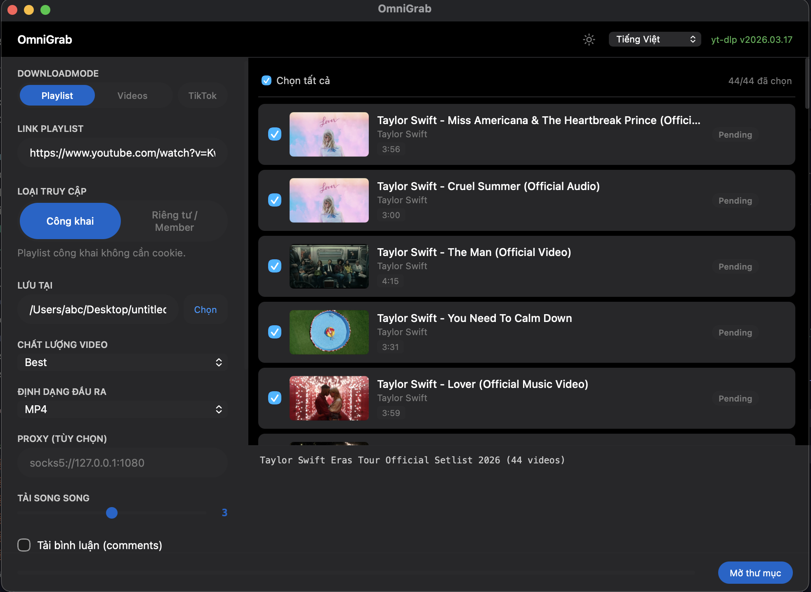

<div align="center">

# OmniGrab

### Tải video YouTube, TikTok — Playlist, Channel, Video đơn — Chỉ với 1 click



[](LICENSE)
[]()
[]()
[]()
[]()

**[Tiếng Việt](#-tính-năng) · [English](#-features)**

[⬇️ Tải xuống](#-cài-đặt) · [Cách sử dụng](#-cách-sử-dụng) · [Build từ source](#-build-từ-source)

</div>

---

## 🇻🇳 Tiếng Việt

### ✨ Tính năng

<table>
<tr><td>

#### 🎬 Tải xuống video
- **3 chế độ** — Playlist, Video đơn, TikTok
- **YouTube Playlist** — Tải cả playlist hoặc channel (paste link `@username`)
- **YouTube Channel** — Dán link `youtube.com/@username` để tải tất cả video
- **TikTok** — Tải video từ user profile hoặc dán nhiều link. Hỗ trợ không watermark
- **Giao diện thẻ (Card UI)** — Xem trước thumbnail, chọn/bỏ chọn từng video
- **Hai giai đoạn** — Bấm "Lấy thông tin" → xem cards → chọn → "Bắt đầu tải"
- **9 định dạng** — MP4, MP3, WebM, MKV, AVI, FLAC, WAV, OGG, M4A
- **4 mức chất lượng** — Best, 1080p, 720p, 480p
- **Chế độ cập nhật** — Tự động bỏ qua video đã tải
- **Flat Output** — Tải tất cả vào 1 folder thay vì tạo subfolder riêng

</td></tr>
<tr><td>

#### ⚡ Tải song song & Tiến trình
- **Parallel downloads** — Tải 1–5 video đồng thời (tuỳ chỉnh)
- **Real-time progress** — Hiển thị tốc độ, ETA, dung lượng mỗi video
- **Thanh tiến trình** — Theo dõi tổng tiến trình + từng video riêng
- **Auto-retry 503** — Tự thử lại khi server busy hoặc lỗi mạng

</td></tr>
<tr><td>

#### 🔐 Hỗ trợ nội dung riêng tư
- **Playlist công khai** — Không cần đăng nhập
- **Playlist riêng tư / Members-only** — Hỗ trợ nhập cookie từ trình duyệt
- **Hướng dẫn 4 bước** — Export cookie trực tiếp trong app

</td></tr>
<tr><td>

#### 💬 Bình luận (Comments)
- **Tải bình luận** — Lấy tất cả bình luận kèm phản hồi lồng nhau
- **Báo cáo HTML** — Tự động tạo trang HTML đẹp để xem bình luận
- **Xuất JSON / CSV** — Xuất dữ liệu bình luận để phân tích

</td></tr>
<tr><td>

#### 📝 Phụ đề (Subtitles)
- **Tải phụ đề** — Tự động tải phụ đề kèm video
- **Chọn ngôn ngữ** — 15+ ngôn ngữ phổ biến + tùy chỉnh
- **Nhúng vào video** — Phụ đề được nhúng trực tiếp vào MP4/WebM/MKV

</td></tr>
<tr><td>

#### 🎵 Metadata & Tagging
- **Tự động gắn tag** — Trích xuất artist, title, genre từ tên video
- **Gắn metadata** — Nhúng ảnh bìa, nghệ sĩ, album vào file (qua ffmpeg)
- **Lưu Info JSON** — Xuất metadata video ra file `.info.json`
- **Hỗ trợ proxy** — SOCKS5 / HTTP proxy để vượt giới hạn địa lý

</td></tr>
<tr><td>

#### 🌗 Giao diện
- **Light / Dark mode** — Chuyển đổi theme theo ý thích
- **Apple-inspired design** — Giao diện tối/sáng phong cách Apple
- **15 ngôn ngữ UI** — Tiếng Việt, English, العربية, 中文, Nederlands, Français, Deutsch, עברית, Italiano, Polski, Português (BR), Română, Русский, Español, Türkçe

</td></tr>
<tr><td>

#### ⚡ Hiệu năng
- **Nhẹ (~4MB)** — So với ~150MB của ứng dụng Electron
- **Tauri 2.0 + Rust** — Backend nhanh, an toàn, tiết kiệm RAM
- **Cross-platform** — macOS (Apple Silicon + Intel) & Windows

</td></tr>
</table>

---

### 📥 Cài đặt

Vào [Releases](https://github.com/nv-minh/YoutubePlaylistDownloaderApp/releases) và tải:

| Nền tảng | File |
|----------|------|
| **macOS Apple Silicon** (M1/M2/M3/M4) | `OmniGrab_*_aarch64.dmg` |
| **macOS Intel** | `OmniGrab_*_x64.dmg` |
| **Windows** | `OmniGrab_*_x64-setup.exe` |

> **Lưu ý macOS**: Nếu gặp lỗi "Cannot be opened because it is from an unidentified developer", chuột phải → Open → Open.

---

### 🎯 Cách sử dụng

#### YouTube Playlist / Channel
1. Chọn tab **Playlist**
2. Dán link playlist hoặc channel YouTube (`youtube.com/@username`)
3. Bấm **Lấy thông tin** → xem cards → chọn video
4. Bấm **Bắt đầu tải**

#### YouTube Video đơn
1. Chọn tab **1 Video**
2. Dán link video YouTube
3. Bấm **Bắt đầu tải**

#### TikTok
1. Chọn tab **TikTok**
2. Dán link user TikTok (`tiktok.com/@username`) hoặc nhiều link video
3. Bấm **Lấy thông tin** → xem cards → chọn video
4. Tùy chọn: bật "Tải không watermark"

#### Playlist riêng tư / Members-only
1. Chuyển sang tab **Riêng tư / Member**
2. Làm theo 4 bước trên màn hình để export cookie
3. Dán nội dung cookie → Bấm **Lấy thông tin**

---

### 🔧 Xử lý lỗi

| Vấn đề | Giải pháp |
|--------|-----------|
| **"Cookie expired"** | Cookie đã hết hạn. Export lại từ trình duyệt |
| **"Members only"** | Cần đăng ký thành viên kênh + dùng cookie mới |
| **Folder trống** | Thường do cookie hết hạn — export lại |
| **yt-dlp không tìm thấy** | App tự cài yt-dlp khi mở lần đầu |

---

### 🏗️ Build từ source

**Yêu cầu:**
- [Node.js](https://nodejs.org/) 18+
- [Rust](https://www.rust-lang.org/tools/install) 1.80+
- macOS: Xcode CLI Tools (`xcode-select --install`)
- yt-dlp (tự cài khi chạy lần đầu)

```bash
git clone https://github.com/nv-minh/YoutubePlaylistDownloaderApp.git
cd YoutubePlaylistDownloaderApp
npm install
npm run tauri dev
```

**Dev commands:**

| Lệnh | Mô tả |
|------|-------|
| `npm install` | Cài dependencies |
| `npm run tauri dev` | Chạy dev server (hot reload) |
| `npm run tauri build` | Build release binary |
| `cd src-tauri && cargo check` | Kiểm tra lỗi compile Rust |
| `cd src-tauri && cargo clippy` | Lint Rust code |

**Release version mới:**
1. Cập nhật version trong `package.json`, `src-tauri/Cargo.toml`, `src-tauri/tauri.conf.json`
2. Commit tất cả thay đổi
3. Tag: `git tag v0.x.0`
4. Push: `git push && git push --tags`
5. GitHub Actions tự build và tạo release

---

### 🛠️ Tech Stack

| Thành phần | Công nghệ |
|-----------|-----------|
| Frontend | TypeScript + Vite — Apple-inspired light/dark theme |
| Backend | Rust (Tauri 2.0) |
| Downloader | yt-dlp |
| Kích thước | ~4MB |

---
---

## 🇬🇧 English

### ✨ Features

<table>
<tr><td>

#### 🎬 Video Download
- **3 modes** — Playlist, Single Video, TikTok
- **YouTube Playlist** — Download full playlists or channels (paste `@username` link)
- **YouTube Channel** — Paste `youtube.com/@username` to grab all channel videos
- **TikTok** — Download from user profiles or paste multiple links. Watermark-free option
- **Card UI** — Preview thumbnails, select/deselect individual videos
- **Two-phase flow** — Click "Fetch Info" → view cards → select → "Start Download"
- **9 Output Formats** — MP4, MP3, WebM, MKV, AVI, FLAC, WAV, OGG, M4A
- **4 Quality Levels** — Best, 1080p, 720p, 480p
- **Update Mode** — Skip already downloaded videos
- **Flat Output** — Download all into one folder instead of subfolders

</td></tr>
<tr><td>

#### ⚡ Parallel Downloads & Progress
- **Parallel downloads** — 1–5 simultaneous downloads (configurable)
- **Real-time progress** — Show speed, ETA, file size per video
- **Progress bars** — Track overall + per-video progress
- **Auto-retry 503** — Automatically retry on server busy or network errors

</td></tr>
<tr><td>

#### 🔐 Private Content Support
- **Public playlists** — No login required
- **Private / Members-only** — Import cookies from your browser
- **4-step guide** — Export cookies directly within the app

</td></tr>
<tr><td>

#### 💬 Comments
- **Download comments** — Fetch all comments with nested replies
- **HTML reports** — Auto-generate beautiful HTML pages for viewing
- **Export JSON / CSV** — Export comment data for analysis

</td></tr>
<tr><td>

#### 📝 Subtitles
- **Download subtitles** — Automatically fetch subtitles with videos
- **Language selection** — 15+ popular languages + custom option
- **Embed into video** — Subtitles embedded directly into MP4/WebM/MKV

</td></tr>
<tr><td>

#### 🎵 Metadata & Tagging
- **Auto-tagging** — Extract artist, title, genre from video title
- **Metadata injection** — Embed thumbnail, artist, album into files (via ffmpeg)
- **Save Info JSON** — Export video metadata as `.info.json` file
- **Proxy support** — SOCKS5 / HTTP proxy to bypass geo-restrictions

</td></tr>
<tr><td>

#### 🌗 UI
- **Light / Dark mode** — Toggle theme to your preference
- **Apple-inspired design** — Clean dark/light theme following Apple HIG
- **15 UI languages** — Vietnamese, English, العربية, 中文, Nederlands, Français, Deutsch, עברית, Italiano, Polski, Português (BR), Română, Русский, Español, Türkçe

</td></tr>
<tr><td>

#### ⚡ Performance
- **Lightweight (~4MB)** — Compared to ~150MB for Electron apps
- **Tauri 2.0 + Rust** — Fast, safe, low memory backend
- **Cross-platform** — macOS (Apple Silicon + Intel) & Windows

</td></tr>
</table>

---

### 📥 Installation

Go to [Releases](https://github.com/nv-minh/YoutubePlaylistDownloaderApp/releases) and download:

| Platform | File |
|----------|------|
| **macOS Apple Silicon** (M1/M2/M3/M4) | `OmniGrab_*_aarch64.dmg` |
| **macOS Intel** | `OmniGrab_*_x64.dmg` |
| **Windows** | `OmniGrab_*_x64-setup.exe` |

> **macOS note**: If you see "Cannot be opened because it is from an unidentified developer", right-click → Open → Open.

---

### 🎯 How to Use

#### YouTube Playlist / Channel
1. Select **Playlist** tab
2. Paste YouTube playlist or channel URL (`youtube.com/@username`)
3. Click **Fetch Info** → view cards → select videos
4. Click **Start Download**

#### Single YouTube Video
1. Select **1 Video** tab
2. Paste YouTube video URL
3. Click **Start Download**

#### TikTok
1. Select **TikTok** tab
2. Paste TikTok user URL (`tiktok.com/@username`) or multiple video links
3. Click **Fetch Info** → view cards → select videos
4. Optional: enable "Download without watermark"

#### Private / Members-only Playlist
1. Switch to **Private / Members-only** tab
2. Follow the 4-step on-screen guide to export cookies
3. Paste cookie content → Click **Fetch Info**

---

### 🔧 Troubleshooting

| Issue | Solution |
|-------|----------|
| **"Cookie expired"** | Cookies expired. Re-export from browser |
| **"Members only"** | Must be a channel member + use fresh cookies |
| **Empty folders** | Usually expired cookies — re-export and try again |
| **yt-dlp not found** | App auto-installs yt-dlp on first launch |

---

### 🏗️ Build from Source

**Prerequisites:**
- [Node.js](https://nodejs.org/) 18+
- [Rust](https://www.rust-lang.org/tools/install) 1.80+
- macOS: Xcode CLI Tools (`xcode-select --install`)
- yt-dlp (auto-installed on first run)

```bash
git clone https://github.com/nv-minh/YoutubePlaylistDownloaderApp.git
cd YoutubePlaylistDownloaderApp
npm install
npm run tauri dev
```

**Dev commands:**

| Command | Description |
|---------|-------------|
| `npm install` | Install dependencies |
| `npm run tauri dev` | Run dev server (hot reload) |
| `npm run tauri build` | Build release binary |
| `cd src-tauri && cargo check` | Check Rust compilation |
| `cd src-tauri && cargo clippy` | Lint Rust code |

**Release new version:**
1. Update version in `package.json`, `src-tauri/Cargo.toml`, `src-tauri/tauri.conf.json`
2. Commit all changes
3. Tag: `git tag v0.x.0`
4. Push: `git push && git push --tags`
5. GitHub Actions auto-builds and creates release

---

### 🛠️ Tech Stack

| Component | Technology |
|-----------|-----------|
| Frontend | TypeScript + Vite — Apple-inspired light/dark theme |
| Backend | Rust (Tauri 2.0) |
| Downloader | yt-dlp |
| Size | ~4MB |

---

<div align="center">

## 📄 License

This project is licensed under the [MIT License](LICENSE).

Nếu app này hữu ích, hãy cho repo một ⭐ nhé!

If you find this app useful, please give the repo a ⭐!

</div>
